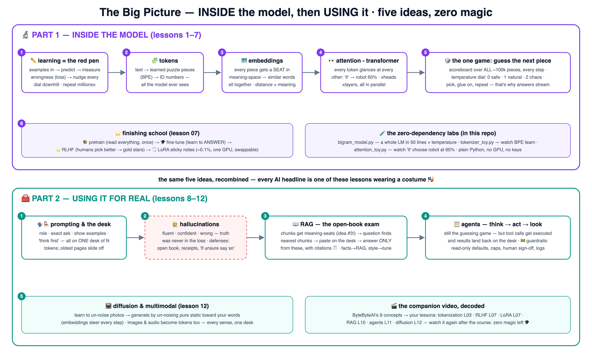

# 🧠 Learn AI the School Way

The school-analogy method — proven on
[Kubernetes](https://github.com/BaluRaut/learn-kubernetes-school),
[Docker](https://github.com/BaluRaut/learn-docker-school),
[AWS](https://github.com/BaluRaut/learn-aws-school) and
[ArgoCD](https://github.com/BaluRaut/learn-argocd-school) — now applied to **AI**:
how models actually work (tokens → embeddings → attention → RLHF & LoRA) and how to
use them well (prompting, RAG, agents, diffusion).

🌐 **Interactive site:** **<https://baluraut.github.io/learn-ai-school/>** — lesson cards,
every lesson as a ByteByteGo-style numbered diagram, the big-picture 4K, trade-offs and a study plan.

🎬 **Companion video:** [9 AI Concepts Explained in 7 minutes](https://www.youtube.com/watch?v=nVnxG10D5W0)
(ByteByteAI) — watch it first for the aerial view; this course is the slow, hands-on ground tour
of every concept it names (agents, RAG, tokenization, RLHF, diffusion, LoRA…).

## 🗺️ The big picture — one diagram, both worlds



## 🎓 The 12 lessons

Each numbered branch adds ONE lesson folder (`lessons/NN-topic/README.md`) with an
explain-like-I'm-5 story, a school analogy, a diagram, **What / Why / How**, and a hands-on
lab — many powered by this repo's **zero-dependency Python demos** (no GPU, no API key,
no pip install!). Branches are **sequential** — branch 07 contains lessons 01–07.

```bash
git checkout lesson-01-what-is-ai    # read lessons/01-what-is-ai/README.md, then...
git checkout lesson-02-training      # ...keep going, one branch at a time
```

### Part 1 — Inside the model 🔬

| # | Branch | You learn | Analogy |
|---|---|---|---|
| 01 | `lesson-01-what-is-ai` | AI vs ML vs deep learning | Rulebooks vs learning from examples 📖 |
| 02 | `lesson-02-training` | Loss & gradient descent — how learning works | Practice tests + the red pen ✏️ |
| 03 | `lesson-03-tokens` | Tokenization — what models actually read | Cutting text into puzzle pieces 🧩 |
| 04 | `lesson-04-embeddings` | Embeddings — meaning as coordinates | The seating chart of meanings 🗺️ |
| 05 | `lesson-05-next-token` | Next-token prediction & temperature | The sentence-completion game 🎲 |
| 06 | `lesson-06-attention` | Attention & transformers | Kids glancing around the class 👀 |
| 07 | `lesson-07-rlhf-lora` | Pretraining → fine-tuning → RLHF → LoRA | Library, etiquette class, gold stars, sticky notes ⭐ |

### Part 2 — Using it for real 🧰

| # | Branch | You learn | Analogy |
|---|---|---|---|
| 08 | `lesson-08-prompting-context` | Prompting & the context window | How you ask the librarian 🗣️ + the small desk 🪑 |
| 09 | `lesson-09-hallucinations` | Why models make things up | The confident kid who never says "I don't know" 🙋 |
| 10 | `lesson-10-rag` | Retrieval-Augmented Generation | The open-book exam 📖 |
| 11 | `lesson-11-agents` | Agents & tool use | A student with a to-do list and a hall pass 📋 |
| 12 | `lesson-12-diffusion` | Diffusion & multimodal models | Un-blurring TV static, step by step 📺 |

## 📦 What's in this repo (main branch)

```
learn-ai-school/
├── demo/
│   ├── bigram_model.py     # a COMPLETE language model in ~50 lines + temperature dial
│   ├── tokenizer_toy.py    # watch BPE learn its puzzle pieces
│   └── attention_toy.py    # watch 'it' figure out it means 'robot' (65%!)
└── docs/                   # the GitHub Pages site
```

Everything runs with plain **Python 3** — no GPU, no API keys, no installs.

## 🚀 Quickest possible taste (60 seconds)

```bash
python3 demo/bigram_model.py     # a language model learns & writes before your eyes
python3 demo/attention_toy.py    # attention decides who 'it' refers to
```
