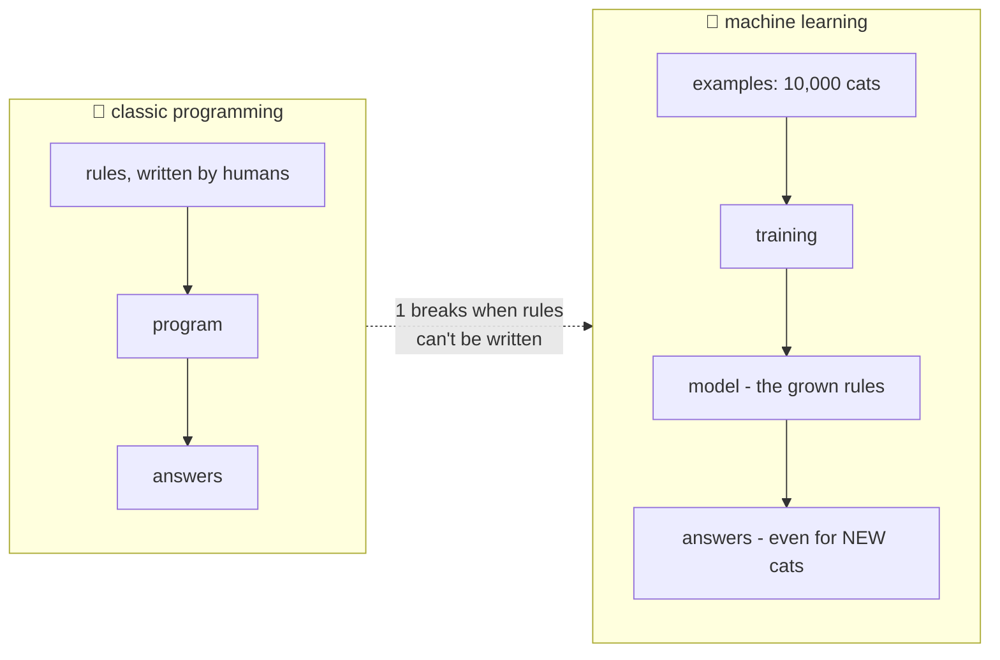

# 📖 Lesson 01 — What is AI: rulebooks vs learning from examples

**📍 You are here:** Lesson **01** of 12 · Next: `lesson-02-training`

---

## 📦 What's in this branch

The foundation: what "AI" actually means, how **machine learning** differs
from normal programming, and where **deep learning** and **LLMs** fit.
Real file: [demo/bigram_model.py](../../demo/bigram_model.py) — you'll run
a real (tiny) learned model today.

## 🧒 Explain like I'm 5

How do you teach a kid to recognize a cat? 🐱

**The rulebook way** (classic programming): write rules — *"pointy ears
AND whiskers AND tail → cat."* Then a fold-eared cat arrives. Add a rule.
A tailless cat. Another rule. A cartoon cat. Forty rules later you quit —
some things have **no writable rulebook**.

**The examples way** (machine learning): show the kid **10,000 photos** —
"cat, cat, not-cat, cat…" — and let them figure out the pattern
themselves. Nobody wrote a single rule; the rules *grew inside the kid*
from examples. Ask them to explain and they shrug: "I just… know." 🤷

That shrug is machine learning's superpower AND its famous weakness: it
works brilliantly, and nobody can fully point at *why* (the rules are
smeared across millions of numbers, not written anywhere).

The family tree: **AI** (the whole ambition: machines doing smart things)
⊃ **machine learning** (the examples way) ⊃ **deep learning** (learning
with many-layered neural networks) ⊃ **LLMs** (deep learning aimed at
language — courses 03–07 open that box).

## 🗺️ Diagram



## ❓ What

- **Model** = the learned artifact: a pile of numbers (**weights/
  parameters**) that encodes the pattern. "Training" produces it;
  "inference" uses it. GPT-class models: billions of weights.
- Classic programming: `rules + data → answers`. Machine learning:
  `data + answers → rules`. Memorize that inversion; it explains
  everything else in the course.
- **Deep learning** = ML where the model is a layered neural network that
  learns its own features (nobody tells it "ears matter").
- Where each wins: rulebooks for exact, auditable logic (payroll, tax);
  learning for fuzzy pattern work (images, speech, language) — the
  [trade-offs page](https://baluraut.github.io/learn-ai-school/before-and-tradeoffs.html)
  makes this precise.

## 🤔 Why

Every headline, fear and product decision about AI traces back to this
one shift: **the rules are grown, not written**. Grown rules generalize
beautifully (new cat? no problem) and fail weirdly (a sticker on a banana
→ "toaster"), and can't be fully inspected. Hold that trade in your head
and the rest of the course is downhill.

## 🧪 Try it (60 seconds, plain Python)

```bash
python3 demo/bigram_model.py
```

Watch it: **learn** from five sentences (counting patterns — that's
training, lesson 02), then **write new text** it was never given
(inference). No rules were written; the model's whole "brain" is printed
at the top — just counts. Bigger counts, same idea, is more of the course
than you'd believe. 😄

## ⏭️ Next

HOW does "showing examples" actually change the model? The red pen:
**training, loss, and gradient descent**.

```bash
git checkout lesson-02-training
```
