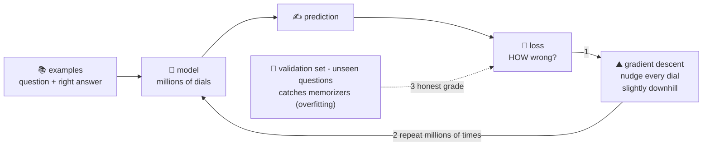

# ✏️ Lesson 02 — Training: practice tests and the red pen

**📍 You are here:** Lesson **02** of 12 · Previous: `lesson-01-what-is-ai` · Next: `lesson-03-tokens`

---

## 📦 What's in this branch

Lesson 01, **plus** the engine of all machine learning: **loss** (how
wrong am I?) and **gradient descent** (which way is less wrong?).

## 🧒 Explain like I'm 5

How does a kid actually get better at math? Not by magic — by the
**practice-test loop** ✏️:

1. **Take a practice test** — the model makes predictions on examples.
2. **The red pen** 🔴 — compare answers to the answer key and count how
   wrong you were. That wrongness-score is the **loss**. (Not just
   right/wrong — HOW wrong: answering 9×7=64 is closer than 9×7=12.)
3. **Adjust, a tiny bit** — here's the beautiful trick: for every one of
   the model's millions of dials (**weights**), calculus can ask *"if I
   turned THIS dial slightly, would the loss go down?"* Then every dial
   gets a tiny nudge in its own downhill direction. That's **gradient
   descent** — "descend the mountain of wrongness one small step at a
   time." ⛰️
4. **Repeat.** Millions of times. Loss drifts down, the kid gets sharper.

Two classroom failure modes you must know:
- **Memorizing the test** 📄 (**overfitting**): perfect on practice
  questions, lost on new ones. Cure: grade on questions the kid has
  *never seen* (the **validation set**) — teach to understand, not to
  recite.
- **Cramming pace** (**learning rate**): nudge dials too hard and you
  overshoot the valley and bounce; too soft and school takes forever.
  Tuning this dial-of-the-dials is half the art.

## 🗺️ Diagram



## ❓ What

- **Loss function** — one number measuring wrongness across examples;
  training = minimizing it. For LLMs: "how surprised was I by the true
  next token?" (lesson 05 connects this!).
- **Gradient** — the direction each weight should move to reduce loss;
  **backpropagation** computes it efficiently through all layers.
- **Epochs/batches**: pass over data in chunks; **learning rate**: nudge
  size; **overfitting**: train-score great, validation-score bad.
- Scale intuition: frontier LLM pretraining = this exact loop, run on
  trillions of tokens across thousands of GPUs for months. The loop
  never gets smarter — just bigger.

## 🤔 Why

Every AI capability and every AI cost story is this loop. "Training a
model costs millions" = electricity for step 3 at scale. "The model is
biased" = the answer key (data) was. "Fine-tuning" (lesson 07) = the same
red pen on a smaller, special test. One loop to rule them all.

## 🧪 Try it

```bash
python3 demo/bigram_model.py
```

Our toy skips calculus — for counting, counts ARE the perfect dials
(loss-minimizing, provably!). Now imagine the printed table with
**175 billion** dials that *can't* be solved by counting — only nudged
downhill, example by example. Same table, harder mountain. ⛰️

Paper exercise: the model answers 9×7 with 64 then 61 then 63 across
three nudges. Is the loss going up or down? (Down — the red pen counts
*distance*, and that's why "how wrong" beats "wrong".)

## ⏭️ Next

Before an LLM can practice on text, text must become something a
calculator can chew: **tokens** — the puzzle pieces.

```bash
git checkout lesson-03-tokens
```
