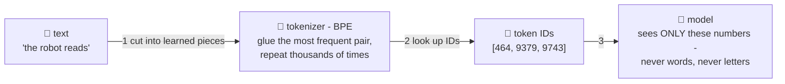

# 🧩 Lesson 03 — Tokens: cutting text into puzzle pieces

**📍 You are here:** Lesson **03** of 12 · Previous: `lesson-02-training` · Next: `lesson-04-embeddings`

---

## 📦 What's in this branch

Lessons 01–02, **plus** the first thing that happens to every prompt you
ever type: **tokenization**. Real file:
[demo/tokenizer_toy.py](../../demo/tokenizer_toy.py) — watch a tokenizer
*learn* its pieces.

## 🧒 Explain like I'm 5

A model is a calculator — it eats numbers, not letters. So before
anything else, text is cut into **puzzle pieces** 🧩 and each piece gets
an ID number. Which pieces? Here's the clever part — nobody chooses them
by hand. The tokenizer **learns** them from data, by one dumb-sounding
rule repeated thousands of times:

> *"Find the two pieces that appear next to each other most often.
> Glue them into one piece. Repeat."* (That's **BPE** — byte-pair
> encoding.)

Run it long enough and the pieces become wonderfully sensible: common
words end up as ONE piece (`the`, ` school`), rare words get built from
sub-pieces (`un` + `believ` + `able`), and anything — any typo, any
language, any emoji — can still be spelled out from small pieces. ~50–100
thousand pieces cover all human text.

This explains real quirks you've met:
- **"How many R's in strawberry?"** struggles — the model sees
  `[st][raw][berry]`-ish IDs, **never letters**. Counting letters through
  frozen puzzle pieces is genuinely hard! 🍓
- **Pricing & limits are "per token"** — you now know exactly what's
  being counted (~¾ of a word each, in English).
- Some languages cost 2–3× more tokens — their pieces were rarer in the
  training data, so they got smaller pieces.

## 🗺️ Diagram



## ❓ What

- **Token** = one learned text piece with an ID. Rule of thumb: 1 token ≈
  4 characters ≈ ¾ English word; "1,000 tokens ≈ 750 words".
- The **vocabulary** (all pieces + IDs) is fixed at training time —
  the model's alphabet forever after.
- Everything downstream counts in tokens: context windows (lesson 09),
  API pricing, speed ("tokens per second"), and the model's *output* is
  chosen one token at a time (lesson 05).
- Subword beats the alternatives: word-level can't handle new words;
  character-level makes sequences brutally long. BPE is the compromise
  that won.

## 🤔 Why

Tokens are the model's *sensory system* — it literally cannot perceive
anything finer. Half the "LLMs are weirdly bad at X" list (spelling
games, arithmetic on long numbers, rhyming in some languages) dissolves
into "of course — look at the pieces it actually sees." Debugging model
behavior starts with *what did it see*, and this is what it sees.

## 🧪 Try it

```bash
python3 demo/tokenizer_toy.py
```

Watch BPE glue `e+a`, then `t+he`, then grow `tea`/`ead` — sensible
pieces emerging from a dumb rule, before your eyes. Then go play with a
real one: OpenAI's tokenizer playground or `tiktoken` — paste
`unbelievable`, `strawberry`, and a Hindi sentence, and count the pieces.

## ⏭️ Next

Each piece-ID then becomes a list of numbers that encodes its
**meaning** — near-synonyms end up neighbors: **embeddings**, the seating
chart of meanings.

```bash
git checkout lesson-04-embeddings
```
