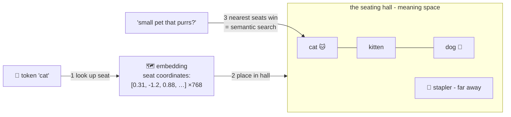

# 🗺️ Lesson 04 — Embeddings: the seating chart of meanings

**📍 You are here:** Lesson **04** of 12 · Previous: `lesson-03-tokens` · Next: `lesson-05-next-token`

---

## 📦 What's in this branch

Lessons 01–03, **plus** the idea that makes semantic search, RAG and
"the model understands me" possible: **embeddings** — meaning as
coordinates. Real file:
[demo/attention_toy.py](../../demo/attention_toy.py) — its hand-made
4-number vectors ARE tiny embeddings.

## 🧒 Explain like I'm 5

Imagine a school hall so large you can seat **every word in the
language** — and one rule: **kids with similar meanings sit close
together.** 🗺️

- `cat` sits next to `kitten`, near `dog`, in the animals corner.
- `king` and `queen` share a bench in royalty row.
- `bank` (money) and `bank` (river)? In context, the model seats the
  token where *this* sentence needs it.

A word's **embedding** is simply its **seat coordinates** — not 2
numbers like a real map, but hundreds (~1,000+ dimensions), because
meaning has many directions: alive-ness, size, formality, sentiment…

Where does the chart come from? **Nobody draws it.** During training
(lesson 02's red pen), the seats are dials like everything else — and the
model discovers that seating similar words together makes next-word
prediction easier. Meaning emerges as *geometry*.

And geometry means MATH on meanings:
- **distance = similarity** — "find sentences near this question" is
  just… measuring. (That's the entire engine of RAG, lesson 10!)
- the famous party trick: `king − man + woman ≈ queen` 👑 — directions
  in the hall mean things ("royalty-ward", "plural-ward").

## 🗺️ Diagram



## ❓ What

- **Embedding** = a learned dense vector for a token (and by pooling,
  for sentences/documents/images too — anything can get a seat).
- **Similarity** = cosine/dot-product between vectors — cheap and
  parallel. "Semantic search" = embed the query, embed the documents,
  return the nearest.
- **Vector databases** (Pinecone, pgvector…) = purpose-built halls for
  storing millions of seats and finding neighbors fast — the plumbing
  under RAG (lesson 10).
- Inside the LLM: layer one turns each token ID into its embedding;
  everything after (attention, lesson 06) is moving those seats around
  as the context demands.

## 🤔 Why

Embeddings are the answer to "how can a calculator *compare meanings*?"
Once meaning is geometry, fuzzy human questions become measurable:
search that ignores exact words, "find similar tickets", "which docs
answer this?" — all just distance. If lesson 03 was the model's senses,
this is its **space of thought**.

## 🧪 Try it

```bash
python3 demo/attention_toy.py
```

Look at the hand-made vectors at the top: `robot [0.9, 0.7, 0.1, 0.6]`
vs `it [0.8, 0.5, 0.0, 0.5]` — deliberately seated CLOSE (similar
meaning-shape), while `because` sits far away. The printout then shows
similarity doing real work. Paper lab: invent 4-number seats for
`pizza`, `burger`, `homework` — which two sit together, and what do your
4 directions mean?

## ⏭️ Next

Senses ✓, space of thought ✓ — now the actual JOB the whole machine was
trained for: **predicting the next puzzle piece**, with a dial for how
adventurous to be.

```bash
git checkout lesson-05-next-token
```
