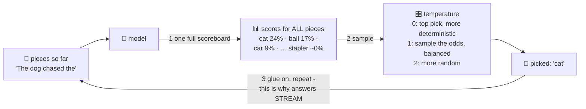

# 🎲 Lesson 05 — Next-token prediction: the sentence-completion game

**📍 You are here:** Lesson **05** of 12 · Previous: `lesson-04-embeddings` · Next: `lesson-06-attention`

---

## 📦 What's in this branch

Lessons 01–04, **plus** the shocking truth at the center of every LLM:
the entire job is **guess the next puzzle piece** — repeated. Real file:
[demo/bigram_model.py](../../demo/bigram_model.py) — the temperature dial
is the star today.

## 🧒 Explain like I'm 5

The teacher plays a game: *"The dog chased the ___"*. Every kid shouts a
guess — cat! ball! mailman! An LLM plays **exactly this game**, and
nothing else. One round works like this:

1. Read all the pieces so far (the prompt + everything written).
2. Produce a **score for EVERY piece in the vocabulary** — all ~100,000 —
   "how likely is each to come next?": `cat 24%, ball 17%, car 9%, …
   stapler 0.0001%`.
3. **Pick one** — and here's the personality dial 🎛️:
   - **Temperature ≈ 0**: always take the top guess. Safe, consistent,
     a bit boring. (What you want for code and facts.)
   - **Temperature ≈ 1**: sample by the odds — mostly-likely with
     surprises. (Natural prose.)
   - **Temperature ↑ 2**: underdog pieces win often. Creative → unhinged.
4. **Glue the picked piece on, go to step 1.** One piece per round —
   that's why answers *stream* word by word; you're literally watching
   the loop spin.

"But it just predicts text!" — yes, AND: to predict the next piece of
*"...therefore the answer is"* after a physics problem, the machinery
must encode a lot of physics. Prediction at scale quietly bought
understanding-shaped abilities. That's THE surprise of modern AI. 🤯

## 🗺️ Diagram



## ❓ What

- The output layer really is a probability over the whole vocabulary,
  every step; training's loss (lesson 02) = "how surprised were you by
  the true next token?" — the red pen and the game are the same thing.
- **Sampling knobs**: temperature (sharpen/flatten the odds), top-p /
  top-k (only sample from the plausible shortlist). Determinism ≈
  temperature 0 (still not perfectly guaranteed in practice).
- **Everything is generation**: answering, translating, "reasoning",
  refusing — all just likely-next-piece under different contexts. Chat
  models differ from base models only in *what* text they were shaped to
  find likely (lesson 07).
- Cost/speed follow directly: N output tokens = N full scoreboard
  computations — why long answers cost more and stream slowly.

## 🤔 Why

This is THE demystifier. "Why does it sometimes give different answers?"
(sampling). "Why does it start strong then ramble?" (each pick
conditions the next). "Why do wrong facts sound so fluent?" (fluency IS
likelihood — truth isn't in the loss; lesson 09 pulls that thread).
Every knob in every AI playground is now a knob on a game you fully
understand.

## 🧪 Try it

```bash
python3 demo/bigram_model.py
```

Run it three times. Temperature 0.01 repeats itself verbatim; 1.0 varies
sensibly; 2.0 gets weird. Same "brain", different dial — now you know
why your favorite chatbot has a temperature setting, and what it does,
from the inside.

## ⏭️ Next

One gap: HOW does the model weigh *"the dog that chased the cat which
climbed the…"*? Which earlier pieces matter for THIS guess?
**Attention** — the glancing-around trick that changed everything.

```bash
git checkout lesson-06-attention
```
