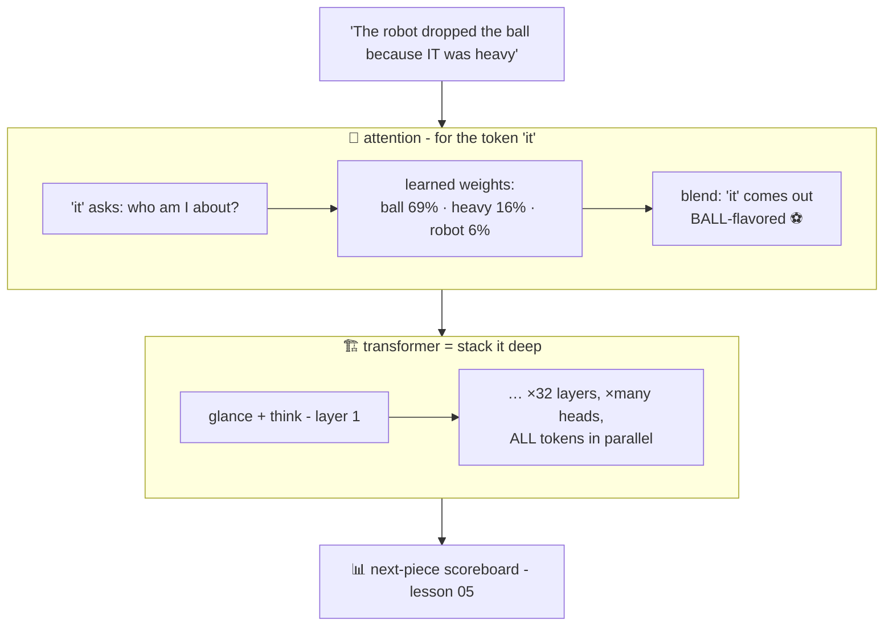

# 👀 Lesson 06 — Attention & transformers: kids glancing around the class

**📍 You are here:** Lesson **06** of 12 · Previous: `lesson-05-next-token` · Next: `lesson-07-rlhf-lora`

---

## 📦 What's in this branch

Lessons 01–05, **plus** the 2017 invention the whole AI boom stands on:
**attention** and the **transformer**. Real file:
[demo/attention_toy.py](../../demo/attention_toy.py) — real attention
math, 40 lines, no libraries.

## 🧒 Explain like I'm 5

Read this: *"The robot dropped the ball because **it** was heavy."*
What's "it"? You didn't go ask a grammar book — your eyes **glanced
back** 👀, weighed the candidates (robot? ball?), and "heavy" tipped the
scales. Instant, silent, weighted glancing.

**Attention is exactly that, as math.** When the model processes each
token, that token gets to *look at every other token in the context* and
decide — with learned weights — **who matters right now**:

- `it` glances hardest at `ball` — the heavy thing — then at `heavy` itself
  (our demo prints: ball 69%!)
- each glance is a **weighted blend**: the token's meaning-seat
  (lesson 04!) gets pulled toward what it attended to — `it` starts
  generic and comes out ball-flavored ⚽
- and it happens **many times in parallel** (multi-head: one head
  tracking grammar, another names, another distance…) and **layer after
  layer**, meanings sharpening each pass.

The **transformer** = the architecture built around this trick, stacked
deep: glance-and-blend, then think (a small dial-network per token),
repeat ×dozens. Its superpower vs older models: all tokens attend **at
once** (not one-by-one like RNNs) — perfect for GPU parallelism → we
could finally train on the whole internet. The 2017 paper's title says
everything: *"Attention Is All You Need."*

## 🗺️ Diagram



## ❓ What

- Mechanics in one line: each token makes a **query** ("what I'm looking
  for"), a **key** ("what I offer") and a **value** ("what you get if
  you pick me"); scores = query·key similarity (dot products on
  embeddings — lesson 04's geometry working); softmax → weights → blend
  of values. Our demo does literally this.
- **Multi-head**: several attention patterns per layer, learned
  independently. **Layers**: dozens of glance-then-think repeats.
- **Context window** (lesson 08's limit!) exists because every token
  attends to every other: cost grows ~quadratically with length. Long
  context = serious engineering.
- The transformer replaced recurrent networks because parallelism let
  training scale — architecture unlocked the data, data unlocked the
  abilities.

## 🤔 Why

This is the "how can it possibly track what 'it' refers to across a
paragraph?" answer — and the "why 2017?" answer. When you hear model
specs — "32 layers, 96 heads, 128k context" — you now picture: how many
glance-rounds, how many parallel glances, how far back eyes can reach.

## 🧪 Try it

```bash
python3 demo/attention_toy.py
```

Real dot-products, real softmax, hand-made seats: watch `it` choose
`ball` at 69% — the heavy thing. Then make `it` robot-shaped
(`[0.5, 0.6, 0.1, 0.1]`, as if the sentence ended *"…because it was
tired"*) and rerun — watch the glance flip to `robot`. You just did
what training does with the red pen: moved a seat, changed a mind.

## ⏭️ Next

We can now build a magnificent autocomplete that read the whole library.
One problem: it completes — it doesn't *behave*. Raw model → helpful
assistant: **fine-tuning, RLHF and LoRA**.

```bash
git checkout lesson-07-rlhf-lora
```
