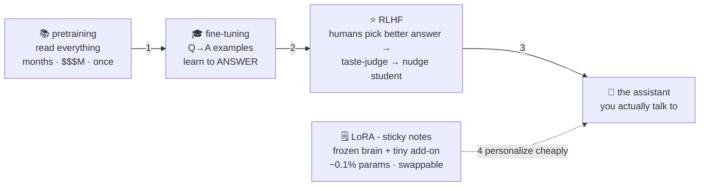

# ⭐ Lesson 07 — RLHF & LoRA: library, etiquette class, gold stars, sticky notes

**📍 You are here:** Lesson **07** of 12 — end of Part 1! · Previous: `lesson-06-attention` · Next: `lesson-08-prompting-context`

---

## 📦 What's in this branch

Lessons 01–06, **plus** the finishing school: how a raw text-predictor
becomes a helpful assistant — **pretraining → fine-tuning → RLHF** — and
the budget trick everyone uses: **LoRA**.

## 🧒 Explain like I'm 5

Raising an assistant takes four schools:

1. **📚 Read the whole library** (**pretraining**): years locked in the
   library reading *everything* — brilliant, knows a billion things, but
   ask "how do I bake bread?" and it might reply *"is a question many
   beginners ask."* It **completes** text; it doesn't *answer* you.
   (Months, millions of dollars, done once.)
2. **🎓 Etiquette class** (**supervised fine-tuning**): show it
   thousands of examples of *"question → helpful answer"* until the
   answering **style** sinks in. Same red pen (lesson 02), tiny special
   curriculum. Now it answers!
3. **⭐ Gold stars** (**RLHF** — reinforcement learning from human
   feedback): it writes two answers; humans pick the better one —
   thousands of times. From those picks, train a **taste-judge model**
   (the reward model), then nudge the student to write answers the judge
   scores high. This is where *helpful, honest, harmless* gets dialed
   in — and where the personality comes from. (Over-dial it and you get
   sycophancy: the kid who says what teachers want to hear. 😬)
4. **🗒️ Sticky notes** (**LoRA**): want the assistant to also speak
   YOUR company's tone? Retraining billions of dials is buying the kid a
   new brain. LoRA instead **freezes the brain** and learns tiny add-on
   note-sheets (a tiny fraction of the model's parameters) whose corrections
   ride on top. Far cheaper to train than the whole brain, swappable (one
   model, many note-sets), removable.

## 🗺️ Diagram



## ❓ What

- **Base vs chat/instruct models**: same architecture — different
  finishing. Base = raw library kid (great for research/completion);
  chat = finished assistant. Model cards say which you're getting.
- **RLHF** pieces: preference data → **reward model** → policy
  optimization (PPO/DPO-family). DPO = a popular shortcut that skips the
  separate judge.
- **LoRA** (Low-Rank Adaptation): freeze weights `W`, learn small
  `A×B` add-ons so effective weights = `W + AB`. Fine-tune with far fewer trainable parameters;
  ship "adapters", not models. QLoRA = same on a quantized brain —
  hobbyist-budget tuning.
- When to tune at all: **style/format/domain-voice → fine-tune (LoRA);
  facts/knowledge → DON'T tune, use RAG** (lesson 10). Tattoo that rule
  somewhere — the [trade-offs page](https://baluraut.github.io/learn-ai-school/before-and-tradeoffs.html)
  expands it.

## 🤔 Why

This lesson explains the difference you FEEL between a raw model and
ChatGPT-style assistants — and why "it's so agreeable" is a training
artifact, not a personality. It also arms you for the #1 practical
question at work: *"should we fine-tune?"* — now you know what tuning
can and cannot add (style yes, facts no), and what it costs with vs
without sticky notes.

## 🧪 Try it (paper lab — the fun kind)

Play etiquette teacher: for the question *"Why is the sky blue?"* write
(a) the completion a **library kid** might produce ("…is a common
question in physics forums. Related: why are sunsets red?") and (b) the
**assistant** answer you'd actually want. Now invent the *third* answer
that's factually right but rude — and notice RLHF's job is exactly to
prefer (b) over BOTH others: correctness AND manner. You've just
hand-simulated the gold-star pipeline. ⭐

## ⏭️ Next — Part 2 begins 🧰

The model is built and finished. Now the OTHER half of the course:
using it well — starting with the skill everyone claims and few
practice: **prompting**, and the small desk it all fits on.

```bash
git checkout lesson-08-prompting-context
```
