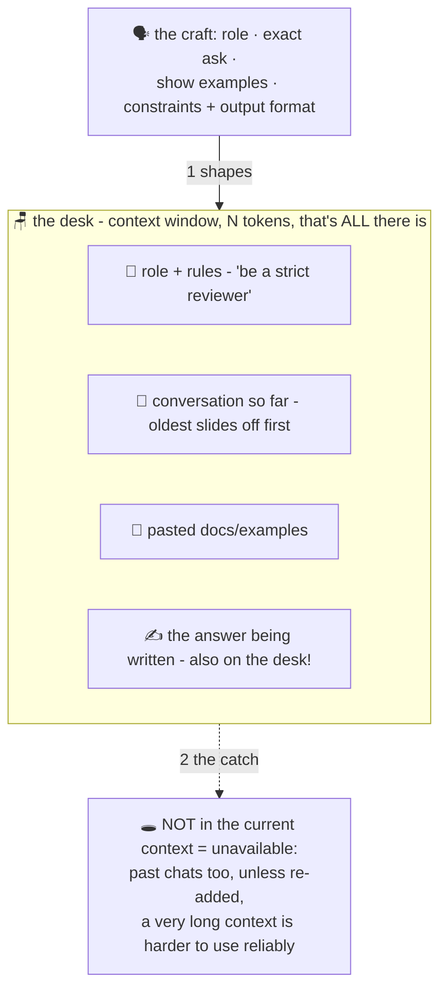

# 🗣️ Lesson 08 — Prompting & the context window: the librarian and the small desk

**📍 You are here:** Lesson **08** of 12 — Part 2 begins! · Previous: `lesson-07-rlhf-lora` · Next: `lesson-09-hallucinations`

---

## 📦 What's in this branch

Lessons 01–07, **plus** the two facts that make or break every AI
interaction: **how you ask** (prompting) and **how much fits on the
desk** (the context window).

## 🧒 Explain like I'm 5

**The librarian** 🗣️: walk up and say *"books?"* — you'll get something
random. Say *"I need three beginner-friendly books about volcanoes, for
a 10-year-old, exciting ones, and tell me why you picked each"* — you
get exactly that. Same librarian, wildly different result. The model has
read everything and can imitate anyone; **your prompt decides which of
its thousand modes shows up.** The craft:

- **Say who to be**: "You are a strict code reviewer" (role).
- **Say exactly what you want**: format, length, audience, constraints.
- **Show, don't just tell**: one or two examples of the output you want
  (**few-shot**) beats paragraphs of description.
- **Give it room to think** (multi-step problems): "show the working, THEN
  the answer" — remember
  lesson 05: each written token conditions the next, so writing the
  reasoning literally builds a ramp to better answers.

**The small desk** 🪑: the librarian is brilliant but the desk holds
only N pages (the **context window** — measured in lesson 03's tokens!).
Everything — your instructions, the conversation so far, pasted
documents, the answer being written — must fit on that ONE desk. Slide a
new page on and an old page slides off (why long chats "forget" the
beginning). And a very crowded desk is harder to use reliably — models often recall
the **start and end** best ("lost in the middle" is a measured effect, not a law).

## 🗺️ Diagram



## ❓ What

- Message anatomy: **system** (standing rules — strongest seat at the
  desk), **user**, **assistant** turns — all just tokens on the desk.
- Window sizes: ~128k tokens (≈ a 300-page book) is common; long ≠
  infinite, and quality degrades before limits ("lost in the middle").
- By default there is **no memory between conversations** (products add it
  by re-inserting notes onto the desk) — "it remembers me" =
  the app quietly re-pasting notes onto the desk each time.
- Prompting is **iteration, not incantation**: change one thing, compare
  outputs, keep what worked. "Prompt engineering" = that loop, done
  honestly.

## 🤔 Why

The cheapest, highest-leverage AI skill: same model, 10× better output,
zero cost. And the desk explains a whole family of mysteries — forgotten
instructions in long chats, degraded answers with huge pastes, why
"summarize then continue" revives a dying conversation, why apps have
system prompts. When output disappoints, ask first: *what was actually
on the desk?*

## 🧪 Try it (in any chatbot — the A/B lab)

```
A: "Write about our new coffee machine."
B: "You are a witty office-newsletter writer. Announce our new coffee
   machine in exactly 3 sentences: one joke, one real detail (it does
   oat milk), one call to action. Tone: friendly, no corporate-speak."
```

Run both. Then test the desk: paste a long article, ask *"what was my
first sentence?"* early and again much later — watch the page slide off.
Finally, for a multi-step math question, compare a bare question with one
that states the constraints and the output format you want ("show the
working, then one line with the answer"). Three experiments, three lessons, five minutes.

## ⏭️ Next

Sometimes the perfectly-asked librarian hands you a beautiful,
confident… fabrication. Why models make things up: **hallucinations**.

```bash
git checkout lesson-09-hallucinations
```
