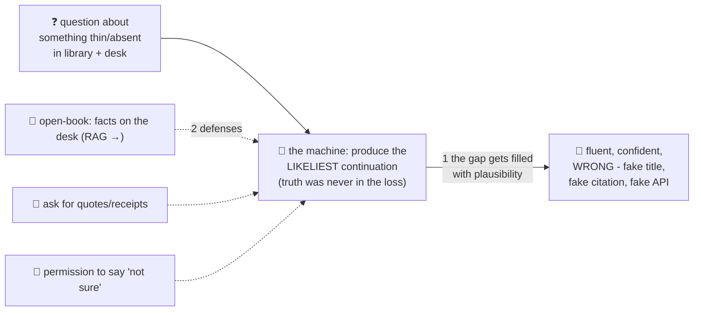

# 🙋 Lesson 09 — Hallucinations: the kid who never says "I don't know"

**📍 You are here:** Lesson **09** of 12 · Previous: `lesson-08-prompting-context` · Next: `lesson-10-rag`

---

## 📦 What's in this branch

Lessons 01–08, **plus** the failure mode you MUST understand before
trusting any model output: **hallucination** — fluent, confident,
wrong.

## 🧒 Explain like I'm 5

There's a kid in every class 🙋 who answers EVERY question instantly,
in perfect sentences, beaming with confidence… and is sometimes
completely wrong. Ask him for a book about Mongolian pirates and he'll
recommend one — *title, author, page count* — that **does not exist**.

Here's the key: **he isn't lying.** Look inside (you now can!):

- His whole skill is *likely-sounding continuation* (lesson 05). The
  training red pen (lesson 02) rewarded **plausible**, never checked
  **true** — truth was never in the loss.
- Asked about something not on his desk (lesson 08) and only thinly in
  his library (lesson 07), the most *likely* continuation of "a book
  about Mongolian pirates is…" is a **realistic-sounding title**. The
  same machinery that writes lovely prose writes lovely fake citations —
  hallucination isn't a glitch in the machine, it **is** the machine,
  pointed at a gap.
- And RLHF's gold stars (lesson 07) made things trickier: humans prefer
  confident answers, so "hmm, I'm not sure" got trained *down*. 😬

Defenses that actually work:
1. **Open-book beats closed-book** — put the facts ON the desk (paste
   them, or automate that: RAG, next lesson). Models are far more
   truthful about text in front of them.
2. **Ask for receipts**: "quote the exact sentence you're basing this
   on" — fabrications get shy when asked to point.
3. **Give permission to not know**: "if unsure, say so" genuinely helps.
4. **The stakes rule**: verify anything you'd act on — names, numbers,
   dates, citations, laws, dosages. Fluency is NOT evidence.

## 🗺️ Diagram



## ❓ What

- **Hallucination** = confident output unmoored from fact: citations,
  legal cases, APIs, people, prices. Highest risk: specifics from the
  library's thin shelves; lowest: reasoning over text you supplied.
- **Fluency–truth decoupling**: likelihood ≈ how text *sounds*, not
  whether it's so. A model can be simultaneously more articulate and
  less reliable than any human you know.
- Mitigations in production: retrieval/grounding (lesson 10), citations
  UI, self-check passes, temperature ↓ for factual tasks, and human
  review gates where stakes are real.
- Getting better ≠ solved: newer models hallucinate less, but the
  mechanism is structural. Design for it.

## 🤔 Why

Every "AI embarrassed someone" story — invented court cases, fake
refund policies, imaginary APIs — is this lesson ignored. You now hold
the correct mental model: not "smart but occasionally buggy" but
**plausibility engine with no built-in truth-checker** — astonishing
with facts in view (so put them in view!), dangerous when asked to
recall specifics alone.

## 🧪 Try it (any chatbot — hallucination hunting)

```
1) "List 3 books about the history of Mongolian pirates, with authors."
   (a thin-shelf topic — watch for beautiful inventions; then verify one)
2) Paste any article → "Using ONLY this text, answer: …, and quote the
   sentence that supports it."   ← watch reliability jump: open book!
3) "What does the Python function os.path.smoothjoin() do? If it
   doesn't exist, say so."       ← the permission clause at work
```

## ⏭️ Next

Defense #1 — putting the right facts on the desk — deserves its own
machine. The open-book exam, automated: **RAG**.

```bash
git checkout lesson-10-rag
```
