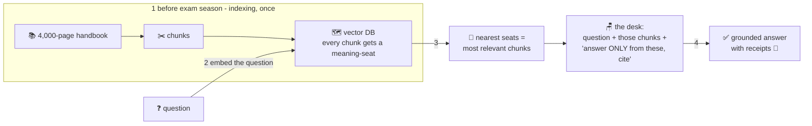

# 📖 Lesson 10 — RAG: the open-book exam, automated

**📍 You are here:** Lesson **10** of 12 · Previous: `lesson-09-hallucinations` · Next: `lesson-11-agents`

---

## 📦 What's in this branch

Lessons 01–09, **plus** the most-deployed AI pattern in industry:
**Retrieval-Augmented Generation** — lesson 04's seating chart and
lesson 08's desk, working together.

## 🧒 Explain like I'm 5

Two exam styles:

- **Closed-book** 🧠: answer from memory. Our brilliant kid does fine on
  famous topics and *invents book titles* on thin ones (lesson 09).
- **Open-book** 📖: the right pages are ON the desk; the kid reads and
  answers. Dramatically more reliable — and he can **point to the line**.

Problem: your company's handbook is 4,000 pages; the desk (lesson 08!)
holds forty. You can't put the whole book on the desk. Enter the
**librarian with the seating chart** — RAG:

1. **Before exam season** (once): cut every document into chunks and
   give each a *meaning-seat* — an embedding (lesson 04). Store the
   seats in a **vector database**.
2. **When a question arrives**: embed the QUESTION too → find the
   chunks *seated nearest* to it (similar meaning = probably relevant —
   pure lesson-04 geometry, no keywords needed).
3. **Open the book to those pages**: paste the top chunks onto the desk
   next to the question — *"Using ONLY these excerpts, answer, and cite
   which excerpt."*
4. The kid answers **from the pages**, with receipts. 🧾

New handbook page? Re-index tonight — the kid "knows" it tomorrow.
Compare fine-tuning (lesson 07): months of etiquette classes can't
reliably add FACTS. **Changing or external facts → RAG; stable behaviour or style →
fine-tuning.** The rule of thumb — not a law.

## 🗺️ Diagram



## ❓ What

- **Pipeline**: chunk (size/overlap matter!) → embed → store → retrieve
  top-k → stuff into prompt → generate with citations.
- **Vector DB**: the hall of seats at scale (pgvector, Pinecone,
  Chroma…) — fast nearest-neighbor search over millions of chunks.
  Production tip: **hybrid search** (meaning + old-school keywords)
  beats either alone; a **reranker** pass sharpens the top-k.
- **Garbage-in rule**: RAG answers are only as good as retrieval — if
  the right chunk isn't fetched, the model is back to closed-book (and
  lesson 09 happens). Evaluate retrieval separately!
- vs **fine-tuning**: RAG = fresh, auditable, per-question knowledge;
  tuning = baked-in style/format. vs **long context**: pasting
  everything works to a point — cost, latency and lost-in-the-middle
  (lesson 08) bring you back to retrieval.

## 🤔 Why

"Chat with your docs / support bot that knows OUR policies / search that
actually understands" — that's RAG, and it's most companies' first real
AI build. You now understand every stage from first principles: the
seats are lesson 04, the desk is lesson 08, the *why* is lesson 09.
Nothing in the stack is magic anymore.

## 🧪 Try it (manual RAG — you are the retriever)

```
1) Pick a long doc the model can't know (your team wiki, a recent PDF).
2) Ask about it WITHOUT pasting → watch closed-book guessing (L09).
3) Now find the 2 relevant paragraphs yourself, paste them + "answer
   ONLY from these excerpts, cite which one" → night and day.
```

You just ran the pipeline by hand — automating step 3 with embeddings
IS the product. (Build it for real: ~30 lines with pgvector or Chroma.)

## ⏭️ Next

Reading is not doing. Give the student a to-do list, a hall pass and
real tools — **agents**: the loop that acts.

```bash
git checkout lesson-11-agents
```
