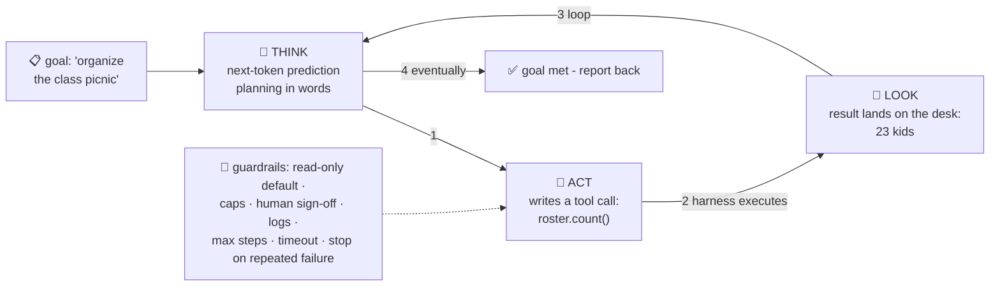

# 📋 Lesson 11 — Agents & tools: a student with a to-do list and a hall pass

**📍 You are here:** Lesson **11** of 12 · Previous: `lesson-10-rag` · Next: `lesson-12-diffusion`

---

## 📦 What's in this branch

Lessons 01–10, **plus** the pattern everyone means by "AI agents":
models that don't just *answer* — they **act**, in a loop, with tools.

## 🧒 Explain like I'm 5

So far our student only *talks*. Ask "what's 847×293?" and he
*predicts likely digits* 😬 (lesson 05 — not actual math!). Ask
"what's on my calendar?" and he can't know (nothing on the desk, L08).

Now give him three school privileges:

1. **🧰 Tools**: a calculator, the library catalog, a phone, permission
   to submit forms. Formally: function descriptions — *"calculator:
   give me an expression, I return the value."*
2. **📋 A to-do list**: a GOAL, not a question — *"organize the class
   picnic."*
3. **🎫 A hall pass**: permission to go do things and come back.

And he works the **agent loop**: *think → act → look → repeat* — until the goal is met, or a
step budget, timeout or repeated failure says stop:

> **Think**: "Picnic. First: how many kids? I'll check the roster."
> **Act**: calls `roster.count()` — writes a tool-call, not prose.
> **Look**: the result (23) lands on his desk.
> **Think**: "23 kids, so 3 pizzas… check the weather next." …

Each round is still lesson 05's next-token game! "Calling a tool" =
the model *writing a special token pattern* the harness executes; the
result is pasted onto the desk; prediction continues. Talking, with
consequences.

The two honest warnings: errors **compound** (one wrong turn early =
confidently wrong everywhere after — lesson 09 with legs 🦿), and
autonomy needs **guardrails**: read-only tools by default, spending
caps, human sign-off gates ("field-trip forms need the teacher's
signature"), and logs of every step.

## 🗺️ Diagram



## ❓ What

- **Tool/function calling**: you describe tools (name, params, purpose);
  the model outputs structured calls; YOUR code executes and returns
  results. The model never touches anything directly — the harness does.
- **Agent** = LLM + tools + loop + goal. RAG (L10) is one tool an agent
  might call; "agentic RAG" = deciding *when* to search.
- Design levers: which tools (capability), which model (judgment),
  loop limits — max steps, a timeout, stop on repeated failure
  (runaway protection), memory/scratchpads for long tasks,
  and **evals** — measure task success, not vibes.
- Multi-agent = students delegating to students (a researcher, a
  writer, a checker). Powerful, and multiplies the compounding-error
  caveat — start with ONE student and few tools.
- You've SEEN one: coding assistants that read files, run tests, edit
  code, retry — that's this exact loop wearing work clothes.

## 🤔 Why

Agents are where AI shifts from *advice* to *outcomes* — booking,
fixing, filing, researching. Every framework headline ("autonomous
agents! computer use!") is this one loop with better tools and longer
leashes. Knowing the loop — and that it's still next-token prediction
with receipts — lets you judge both the magic and the risk soberly.

## 🧪 Try it (be the harness — 10 minutes)

In any chatbot, paste:

```
You have one tool: calc(expression) → number. To use it, reply with
ONLY: CALL calc("..."). I'll reply with the result. Then continue.
Task: what's 847×293, minus 12% of it, split across 23 kids?
```

Execute its calls yourself (any calculator), paste results back, watch
it loop to the answer. Feel how the division of labor works — model
thinks, tools compute, desk carries state. You are the guardrail. 🚧

## ⏭️ Next

The finale: models that paint 🎨 — how "TV static → picture" works
(**diffusion**), and how one model learned to see and hear too.

```bash
git checkout lesson-12-diffusion
```
