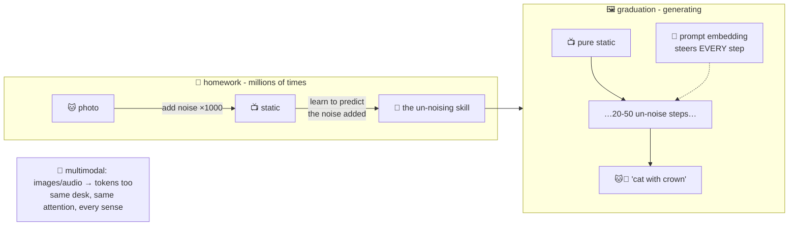

# 📺 Lesson 12 — Diffusion & multimodal: un-blurring the TV static

**📍 You are here:** Lesson **12** of 12 · Previous: `lesson-11-agents` · Bonus next: `lesson-13-mcp`

---

## 📦 What's in this branch

The complete core course — all 12 lessons (lesson 13 is the bonus MCP intro). The finale: how image generators
work (**diffusion**), and how models got eyes and ears (**multimodal**).

## 🧒 Explain like I'm 5

**Art class, weirdest exercise ever** 🎨: the teacher takes a photo of a
cat and adds a *tiny* bit of TV-static noise. Then a bit more. And
more — 1,000 steps until it's pure static. The student's homework:
learn to run this film **backwards** — *"here's a slightly-noisy cat;
tell me what noise was added"* — millions of times, on millions of
photos (the red pen again! lesson 02).

Graduation day: hand the student **pure static** and say *"there's a
'cat wearing a crown' hidden in there — remove the noise."* Step by
step, 20–50 rounds, he "finds" it: static → vague shapes → cat-ish →
crown glints → masterpiece. 📺➡️🐱👑 **There was never a cat in the
static** — un-noising toward what the words demand *creates* one. The
words steer via — you guessed it — embeddings (lesson 04): the prompt's
meaning-seat guides every de-noising step. (In practice it happens in a
compressed "latent" sketch-space — smaller canvas, same idea — that's
the "latent diffusion" in Stable Diffusion.)

**And multimodal?** 👀👂 The lesson-03 trick generalizes: images become
patch-tokens, audio becomes sound-tokens — different senses, same desk,
same attention (lesson 06). That's how one model reads your screenshot,
hears a voice note, and answers in text: everything became tokens in a
shared meaning-space. One classroom, every subject.

## 🗺️ Diagram



## ❓ What

- **Diffusion**: train to reverse gradual noising; generate by iterated
  denoising from noise, steered by a text-embedding. Why it beat
  one-shot generation (GANs): 50 small corrections are more stable
  than one giant leap — each step only needs to be *slightly* right.
- Steps↔quality↔speed tradeoff; **latent diffusion** = do it in a
  compressed space (fast enough for laptops); same recipe powers video
  and audio generation.
- **Multimodal LLMs**: a vision encoder turns image patches into
  token-embeddings the transformer attends over — screenshots, charts,
  photos become "text-like" input. Output side: the LLM can also drive
  a diffusion model (agents' tools, lesson 11 — the painter is a tool!).
- Weak spots make sense now: text inside generated images (it's
  painting letter-*shapes*, not spelling — lesson 03's revenge), counting
  fingers (global constraints vs local denoising).

## 🤔 Why

Image/video/voice generation went from lab demo to daily tool — and it
runs on ideas you already own: noise-prediction is loss (L02), steering
is embeddings (L04), patches are tokens (L03), fusion is attention
(L06). **That's the course's real graduation: nothing left is magic —
it's the same five ideas, recombined.**

## 🧪 Try it

Any image generator (or just watch its preview): notice generation
*sharpening* from blur — you're literally watching denoising steps.
Then test the theory: prompt `a shop sign that says "WELCOME FRIENDS"`
(letter-shapes, L03's revenge) and `a hand holding five pencils`
(global constraints). Failures you can now *explain* are failures you
can work around.

## 🎓 You made it — the whole school

Rulebooks vs examples → the red pen → puzzle pieces → the seating
chart → the guessing game → glancing around → etiquette & gold stars →
asking well on a small desk → the confident kid → open-book exams →
hall passes → un-blurring static. **Twelve lessons, five core ideas,
zero magic left.** Go build something — and when the next AI headline
drops, you'll know exactly which lesson it's wearing. 🧠🎓

One bonus remains: the standard plug that connects all of this to your
files, your GitHub, your database — **MCP**.

```bash
git checkout lesson-13-mcp   # 🔌 the universal plug
```
