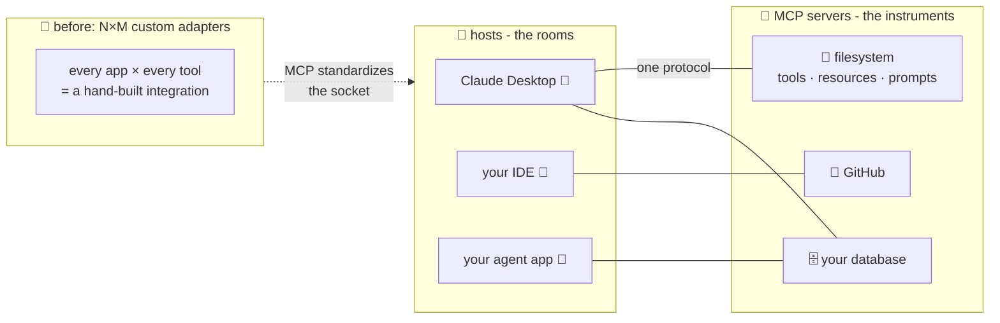

# 🔌 Lesson 13 (bonus) — MCP: the universal plug for AI tools

**📍 You are here:** Bonus lesson **13** · Previous: `lesson-12-diffusion`

---

## 📦 What's in this branch

All 12 core lessons, **plus** the bonus everyone building agents meets
within a week: **MCP — the Model Context Protocol** — the standard that
turns lesson 11's tools into plug-and-play parts.

## 🧒 Explain like I'm 5

The school's science lab has a problem. 🔬 Every instrument — microscope,
scale, thermometer — comes with its **own weird cable**, and every
classroom has **different sockets**. Want the microscope in Room 3?
Someone hand-builds a Room-3-microscope adapter. New scale? Five rooms =
five new adapters. With **N rooms and M instruments you need N×M
adapters** — the janitor's drawer is a nightmare of one-off cables. 🍝

Then the school adopts **one standard wall socket** 🔌. Every instrument
ships with the standard plug; every room has the standard socket. Any
instrument, any room, zero custom adapters: **N+M instead of N×M.**

That's **MCP**, for AI:

- The **instruments** are **MCP servers** — small programs that wrap a
  capability (your files, GitHub, a database, Slack…) behind the
  standard plug.
- The **rooms** are AI apps (**hosts**: Claude Desktop, IDEs, your own
  agent) — each has standard **sockets** (MCP clients).
- Plug any server into any host. The GitHub server someone wrote works
  in *every* MCP-speaking app, today, unchanged.

And each instrument announces what it offers when plugged in — no
manual: *"Hello! I offer these **tools** (things you may do), these
**resources** (things you may read), these **prompts** (recipes I
suggest)."* The model discovers, then uses — lesson 11's loop, with
standardized plugs.

## 🗺️ Diagram



## ❓ What (the details)

- **Roles**: a **host** (the AI app) runs **clients** (one per
  connection); each client speaks to one **server**. Servers expose
  three primitives:
  - **tools** — functions the model may call (lesson 11's calculator,
    standardized),
  - **resources** — readable context (files, records) the host can
    attach to the desk (lesson 08!),
  - **prompts** — reusable prompt templates the server suggests.
- **The wire** (it's refreshingly boring): JSON-RPC. A session in three
  moves:

```json
→ {"method":"initialize", "params":{"clientInfo":{"name":"my-agent"}}}
→ {"method":"tools/list"}
← {"result":{"tools":[{"name":"query_db",
     "description":"Run a read-only SQL query",
     "inputSchema":{"type":"object","properties":{"sql":{"type":"string"}}}}]}}
→ {"method":"tools/call","params":{"name":"query_db","arguments":{"sql":"SELECT …"}}}
← {"result":{"content":[{"type":"text","text":"23 rows: …"}]}}
```

  Discover, then call — the result lands on the desk and lesson 11's
  loop continues. That's the whole ceremony.
- **Transports**: **stdio** (host launches the server as a local child
  process — great for files/dev tools) or **HTTP** (remote/shared
  servers). Same messages either way.
- **Origin & adoption**: introduced by Anthropic (late 2024) as an open
  standard, since adopted across the ecosystem — the rare plug everyone
  agreed on.
- **Security, seriously** 🚧: an MCP server runs with **your**
  permissions — plugging one in is *installing software*. And tool
  RESULTS land on the desk, so a malicious webpage/doc a server fetches
  can try to smuggle instructions to the model (**prompt injection**).
  Lesson 11's guardrails apply double: trusted servers only, read-only
  where possible, human gates for consequential actions, logs always.

## 🤔 Why

Lesson 11 left every team hand-wiring the same tools into every app —
the N×M adapter drawer. MCP collapses it: write your database server
ONCE, use it from Claude Desktop today, your IDE tomorrow, your custom
agent next week. It's also why "agent ecosystems" suddenly work:
capabilities became shareable parts instead of private wiring. (And
you've seen this movie: standard plugs are what Kubernetes did for
containers and Terraform did for infrastructure — boring interfaces are
how ecosystems happen. 🔌)

## 🧪 Try it

**Paper lab (5 min):** you be the host. Take the JSON session above and
write the `tools/list` response for an instrument wrapping your
calendar: what tools (names + arguments)? what resources? what would
you mark read-only vs gated-behind-a-human? Congratulations — you just
designed an MCP server; the SDK version is mostly typing.

**Real lab (15 min, one config edit):** add the reference filesystem
server to any MCP-speaking app (e.g. Claude Desktop →
`claude_desktop_config.json`, or your IDE's MCP settings) following the
quickstart at **modelcontextprotocol.io** — then ask the assistant to
list a folder and summarize a file. Watch which TOOLS it calls. The
protocol you just read is running under every step.

## 🎓 Now the toolbox is truly complete

Twelve lessons of how AI works and how to use it — plus the plug that
connects it to everything else. Zero magic left, sockets included. 🔌🎓

```bash
git checkout main
```
